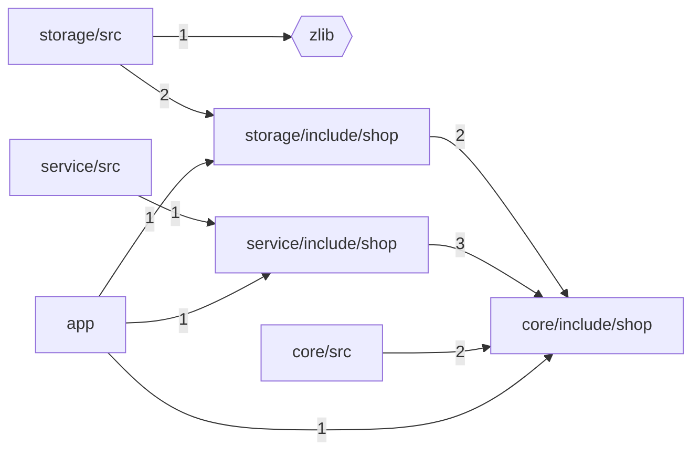
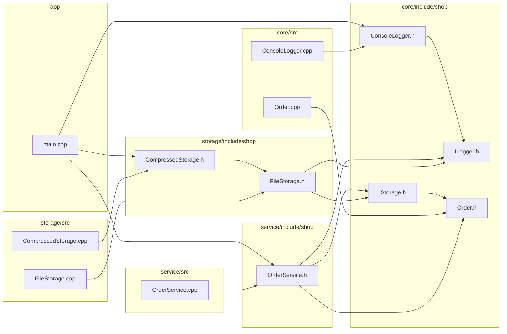

# Code map

## Folders

Arrows point from a folder to what it includes; numbers count the #include pairs. Hexagons are outside libraries.

- app → core/include/shop (1), service/include/shop (1), storage/include/shop (1)
- core/src → core/include/shop (2)
- service/include/shop → core/include/shop (3)
- service/src → service/include/shop (1)
- storage/include/shop → core/include/shop (2)
- storage/src → storage/include/shop (2), zlib (1)

## Files

- app
  - main.cpp → core/include/shop/ConsoleLogger.h, service/include/shop/OrderService.h, storage/include/shop/CompressedStorage.h
- core/include/shop
  - ConsoleLogger.h → ILogger.h
  - ILogger.h
  - IStorage.h → Order.h
  - Order.h
- core/src
  - ConsoleLogger.cpp → core/include/shop/ConsoleLogger.h
  - Order.cpp → core/include/shop/Order.h
- service/include/shop
  - OrderService.h → core/include/shop/ILogger.h, core/include/shop/IStorage.h, core/include/shop/Order.h
- service/src
  - OrderService.cpp → service/include/shop/OrderService.h
- storage/include/shop
  - CompressedStorage.h → FileStorage.h
  - FileStorage.h → core/include/shop/ILogger.h, core/include/shop/IStorage.h
- storage/src
  - CompressedStorage.cpp → storage/include/shop/CompressedStorage.h
  - FileStorage.cpp → storage/include/shop/FileStorage.h

## Where to start reading

Most included (the core everything builds on):

| File | Included by |
| --- | --- |
| `core/include/shop/ILogger.h` | 3 |
| `core/include/shop/Order.h` | 3 |
| `core/include/shop/ConsoleLogger.h` | 2 |
| `core/include/shop/IStorage.h` | 2 |
| `service/include/shop/OrderService.h` | 2 |
| `storage/include/shop/CompressedStorage.h` | 2 |
| `storage/include/shop/FileStorage.h` | 2 |

Most includes (the code that ties things together):

| File | Includes |
| --- | --- |
| `app/main.cpp` | 3 |
| `service/include/shop/OrderService.h` | 3 |
| `storage/include/shop/FileStorage.h` | 2 |
| `core/include/shop/ConsoleLogger.h` | 1 |
| `core/include/shop/IStorage.h` | 1 |
| `core/src/ConsoleLogger.cpp` | 1 |
| `core/src/Order.cpp` | 1 |
| `service/src/OrderService.cpp` | 1 |
| `storage/include/shop/CompressedStorage.h` | 1 |
| `storage/src/CompressedStorage.cpp` | 1 |

## Include cycles

None found.
